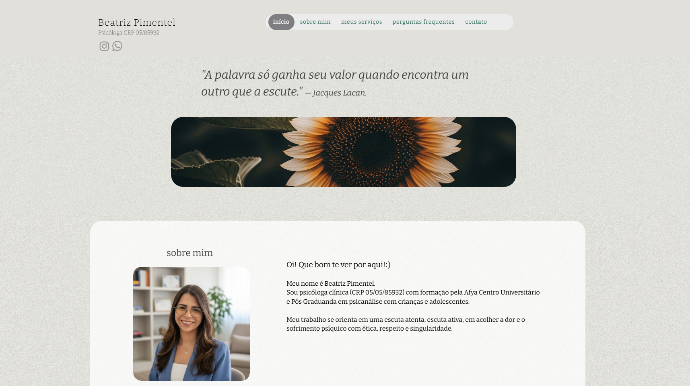

# Landing Page | Beatriz Pimentel

Esta landing page foi desenvolvida para apresentar o trabalho da psicologa Beatriz Pimentel, com foco em uma navegacao simples, acolhedora e objetiva. A pagina foi estruturada para guiar a pessoa visitante pelas principais secoes do atendimento: introducao, sobre mim, servicos, perguntas frequentes e contato.

O objetivo principal do projeto e facilitar o primeiro contato com pacientes, oferecendo uma experiencia clara em desktop e mobile, com menu por ancoras e acesso rapido ao WhatsApp.

## Print do site

## Tecnologias utilizadas

- React 18
- Webpack 5
- Babel
- CSS
- HtmlWebpackPlugin e MiniCssExtractPlugin

## Ganhos de performance

- Imagens nao criticas com `loading="lazy"` e `decoding="async"`, reduzindo custo de carregamento inicial.
- Build com separacao de chunks (`main` e `vendors`) e nomes de arquivos consistentes, evitando conflitos e melhorando cache.
- Navegacao por ancoras nativa com ajuste de `scroll-margin-top`, reduzindo scripts de rolagem desnecessarios e deixando a experiencia mais estavel.
